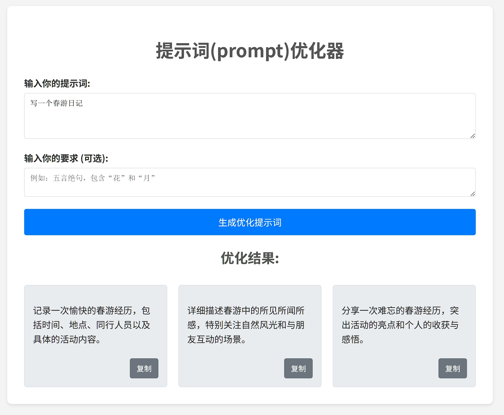

# 提示词优化器 (Prompt Optimizer)

这是一个简单的前后端分离应用，旨在帮助用户优化他们提供给大语言模型（LLM）的提示词（Prompt）。用户输入原始提示词和可选的要求，应用会调用智谱 AI (Zhipu AI) 的 API 来生成三个优化后的提示词版本。


## 📸 截图


## ✨ 功能

*   接收用户输入的原始提示词和优化要求。
*   调用后端服务，该服务安全地与智谱 AI API 交互。
*   展示由 AI 生成的三个优化后的提示词。
*   提供一键复制优化后提示词的功能。

## 🛠️ 技术栈

*   **前端:** HTML, CSS, JavaScript (原生)
*   **后端:** Node.js, Express
*   **API:** 智谱 AI (GLM-4-Flash)
*   **依赖管理:** npm
*   **其他库:**
    *   `node-fetch`: 用于在后端发送 HTTP 请求。
    *   `dotenv`: 用于加载环境变量。
    *   `jsrsasign`: 用于生成 JWT Token 以验证智谱 API 请求。
    *   `cors`: 用于处理跨域资源共享。

## 🚀 快速开始

### 1. 先决条件

*   安装 [Node.js](https://nodejs.org/) (推荐 LTS 版本)
*   拥有一个智谱 AI 的 API Key ([申请地址](https://open.bigmodel.cn/))

### 2. 安装依赖

在项目根目录 (<mcfolder name="prom" path="c:\Users\admin\Desktop\prom"></mcfolder>) 下打开终端，运行以下命令安装后端依赖：

```bash
npm install
```
### 3. 配置环境

*   在项目根目录 (`prom`) 创建一个名为 `.env` 的文件。
*   在 `.env` 文件中添加你的智谱 API Key，格式如下 (请将 `你的ID.你的Secret` 替换为你自己的 API Key)：

    ```env:.env
    ZHIPU_API_KEY=你的ID.你的Secret
    ```

### 4. 运行后端服务

在终端中运行以下命令启动后端 Express 服务器：

```bash
node server.js
```

服务默认运行在 http://localhost:3000 。

### 5. 运行前端

*   直接在浏览器中打开 `index.html` 文件。
*   **重要**: 为了让前端能够访问后端 API，请确保 `script.js` 文件中的 `BACKEND_API_ENDPOINT` 指向你的后端服务地址。对于本地开发，可以取消注释并使用绝对路径：

    ```javascript:c%3A%5CUsers%5Cadmin%5CDesktop%5Cprom%5Cscript.js
    // const BACKEND_API_ENDPOINT = '/api/optimize-prompt'; // 生产环境或使用反向代理时
    const BACKEND_API_ENDPOINT = 'http://localhost:3000/api/optimize-prompt'; // 本地开发时
    ```

### 6. 使用

在打开的网页中输入你的提示词和要求，点击“生成优化提示词”按钮即可。

## 📝 注意

*   请妥善保管你的 `.env` 文件和 API Key，不要将其提交到版本控制系统（项目中已包含 `.gitignore` 文件来忽略 `.env`）。
*   前端 `script.js` 中的 `systemPrompt` 变量定义了优化任务的具体指示，可以根据需要调整。
*   后端使用了 `cors` 中间件允许所有来源的请求，在生产环境中应配置更严格的规则。


